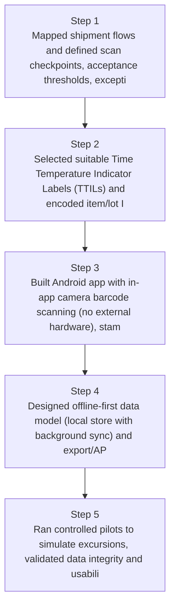
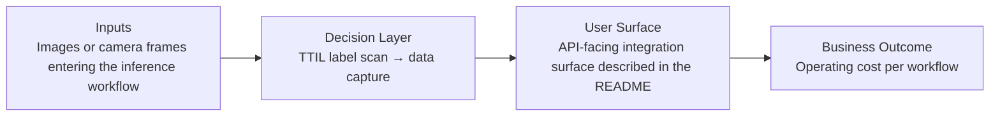
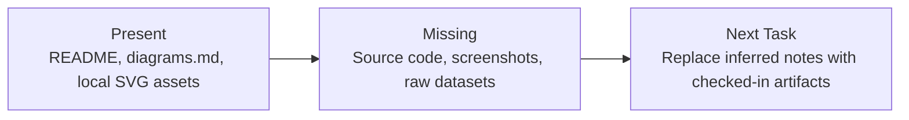

# TTIL Barcode Cold-Chain Tracking Diagrams

Generated on 2026-04-26T04:29:37Z from README narrative plus project blueprint requirements.

## Cold chain checkpoint flow

## TTIL label scan → data capture

## Evidence Gap Map

